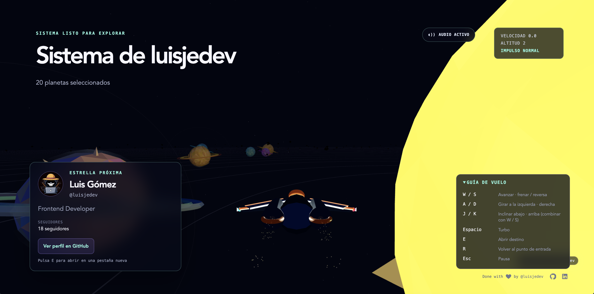

<div align="center">

# 🌌 GitGalaxy

### Tu código, un universo.

Convierte cualquier perfil público de GitHub en un sistema solar 3D explorable.

[](https://react.dev/)
[](https://www.typescriptlang.org/)
[](https://threejs.org/)
[](https://gitspx.com)

### [🚀 Explorar GitGalaxy](https://gitspx.com)

</div>

[](https://gitspx.com)

## ✨ ¿Qué es GitGalaxy?

GitGalaxy transforma los datos públicos de un perfil de GitHub en una galaxia procedural:

- ⭐ El perfil se convierte en la estrella central.
- 🪐 Los repositorios más relevantes se representan como planetas.
- 🎨 El lenguaje, tamaño, actividad y estado de cada proyecto determinan su apariencia.
- 🚀 Una nave low-poly permite recorrer el sistema en tercera persona.
- 🌀 Los agujeros de gusano llevan a otros perfiles públicos aleatorios.
- 🔊 La música, el motor y los efectos se generan en tiempo real con Web Audio.

Cada sistema es determinista: los mismos datos de GitHub producen el mismo universo.

## 🎮 Controles

| Tecla | Acción |
| :---: | --- |
| `W` / `S` | Avanzar · frenar / reversa |
| `A` / `D` | Girar a izquierda · derecha |
| `J` / `K` | Inclinar abajo · arriba |
| `Espacio` | Activar el turbo |
| `E` | Abrir el perfil o repositorio próximo |
| `F` | Añadir o quitar el planeta próximo de favoritos |
| `R` | Volver al punto de entrada |
| `Esc` | Abrir el menú de pausa |

> GitGalaxy está diseñado para ordenadores de escritorio con teclado y un navegador compatible con WebGL.

## 🛠️ Stack

- **React** y **TypeScript** para la aplicación.
- **React Three Fiber** y **Three.js** para la experiencia 3D.
- **Web Audio API** para el audio procedural.
- **Vite** para desarrollo y compilación.
- **Vitest** y **Playwright** para las pruebas.
- **Vercel** para el despliegue estático.

## 🔒 Arquitectura sencilla y privada

La aplicación consulta la REST API pública de GitHub directamente desde el navegador:

- Sin backend ni funciones serverless.
- Sin base de datos ni cuentas de usuario.
- Sin autenticación ni tokens de GitHub.
- Sin analítica ni seguimiento del visitante.
- Con caché local de respuestas válidas durante 15 minutos.

## ⭐ Favoritos locales

Los planetas favoritos se guardan en este navegador, se identifican por el ID estable del repositorio y se comparten entre todos los sistemas visitados. Si el almacenamiento local no está disponible, GitGalaxy mantiene una colección temporal en memoria y muestra una advertencia. No se eliminan favoritos inaccesibles ni se realizan peticiones adicionales para validarlos.

Solo quedan fuera de alcance los favoritos sincronizados mediante una cuenta o un backend.

## 🚀 Desarrollo local

### Requisitos

- Node.js 22 o posterior.
- pnpm 10.
- Un navegador actual con WebGL.

### Instalación

```bash
git clone https://github.com/luisjedev/github-galaxy.git
cd github-galaxy
pnpm install
pnpm dev
```

Vite mostrará la URL local en la terminal. También puedes abrir directamente un perfil mediante una ruta como:

```text
http://localhost:5173/octocat
```

## 🧪 Verificaciones

```bash
pnpm typecheck       # Comprobación de tipos
pnpm lint            # Análisis estático
pnpm test            # Tests unitarios
pnpm test:e2e        # Tests end-to-end
pnpm test:all        # Todas las suites
pnpm build           # Build de producción
```

Para instalar Chromium antes de ejecutar Playwright por primera vez:

```bash
pnpm exec playwright install chromium
```

## ⚙️ Configuración

El TTL de la caché de GitHub puede configurarse en milisegundos:

```bash
VITE_GITHUB_CACHE_TTL_MS=300000 pnpm dev
```

El valor predeterminado es de 15 minutos. Las rutas `/<usuario>` funcionan mediante el fallback de SPA definido en `vercel.json`.

## 🌍 Demo

La versión pública está disponible en:

### **[https://gitspx.com](https://gitspx.com)**

---

<div align="center">

Hecho con 💜 por [@luisjedev](https://github.com/luisjedev)

</div>
